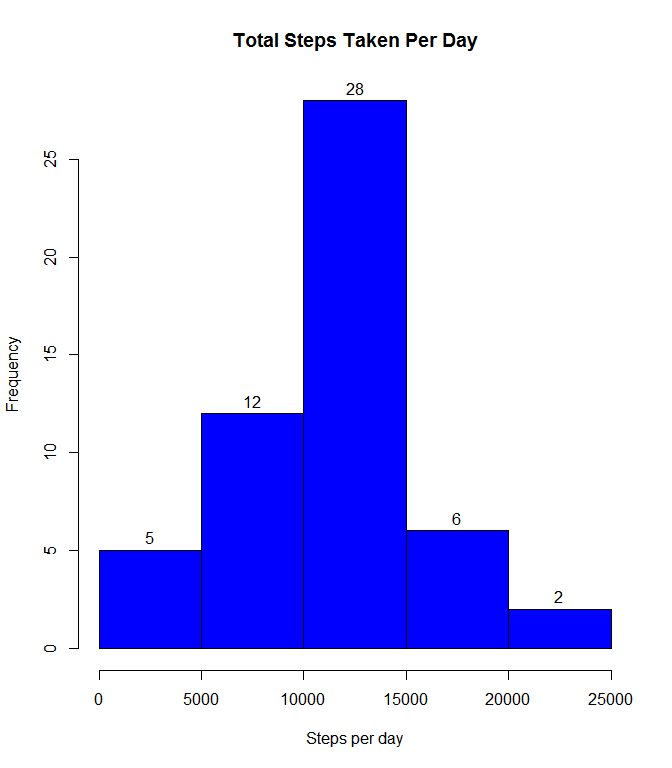

# Reproducible Research: Peer Assessment 1


## Loading and preprocessing the data
- Load the data

```r
unzip("activity.zip")
activitydata <- read.csv("activity.csv")
```

- Process the data

```r
par(mfrow = c(1,1))
activitydata$date <- as.Date(activitydata$date,format = "%Y-%m-%d")
```


## What is mean total number of steps taken per day?
- Calculate total number of steps taken per day

```r
total.steps.day <- setNames(with(activitydata, aggregate(steps, by = list(date), 
                                                FUN = sum)),
                                 c("date","steps"))
```

- Create a histogram of total steps per day

```r
hist(total.steps.day$steps, main = "Total Steps Taken Per Day",
     xlab = "Steps per day",
     col = "blue",
     border = "black",
     labels = TRUE)
```

<!-- -->

- Calculate and report the mean and median of the total number of steps taken per day

```r
meansteps <- round(mean(total.steps.day$steps, na.rm = TRUE), digits = 0)
mediansteps <- round(median(total.steps.day$steps, na.rm = TRUE), digits = 0)
```

The mean steps per day is 1.0766\times 10^{4}  and the median steps per day is 1.0765\times 10^{4}


## What is the average daily activity pattern?
- Time Series Plot of Average Steps Taken by Day

```r
avg.steps.interv <- setNames(aggregate(steps ~ interval,                                                 
                                                 activitydata,
                                                 mean),
                             c("interval", "avg.steps"))

with(avg.steps.interv, plot(interval, avg.steps, type = "l",
                            col = "red",
                            main = "Average Steps Per Interval",
                            xlab = "5 Minute Interval",
                            ylab = "Average Steps"))
```

<!-- -->

- Which interval, on average, has the most amount of steps?

```r
max.interval <- avg.steps.interv[avg.steps.interv$avg.steps == max(avg.steps.interv$avg.steps),1]
```
The 5-minute interval, with the most steps on average is 835

## Imputing missing values
- Calculate number of rows with missing values

```r
sum(is.na(activitydata))
```

```
## [1] 2304
```

- Devise a new strategy to fill in NA values
Will use the mean of each 5-minute interval to fill in NA values


- Create a new dataset with the NA values filled in, using above logic

```r
imputed.data <- activitydata
                           
for (i in 1:nrow(imputed.data)) {
    if(is.na(imputed.data[i,]$steps)) {
        imputed.data[i,]$steps <- avg.steps.interv[imputed.data[i,]$interval == 
                                                       avg.steps.interv$interval,]$avg.steps
    }
}
```

- Make a histogram of the total steps taken each day, using the imputed data in data

```r
imputed.total.steps.day <- setNames(with(imputed.data, aggregate(steps, by = list(date), 
                                                FUN = sum)),
                                 c("date","steps"))

hist(imputed.total.steps.day$steps, main = "Total Steps Taken Per Day",
     xlab = "Steps per day",
     col = "blue",
     border = "black",
     labels = TRUE)
```

<!-- -->

- Calculate the mean and median steps per day for the imputed data.  Are they different from the original calculations?

```r
imputed.meansteps <- round(mean(imputed.total.steps.day$steps, na.rm = TRUE), digits = 0)
imputed.mediansteps <- round(median(imputed.total.steps.day$steps, na.rm = TRUE), digits = 0)
```

The mean steps per day is 1.0766\times 10^{4}  and the median steps per day is 1.0766\times 10^{4}.  The mean stayed the same, but the median increased by 1 step.

## Are there differences in activity patterns between weekdays and weekends?

- Create a new factor variable in the dataset with two levels - "weekday" and "weekend", indicating whether a given date is a weekday or weekend

```r
imputed.data$daytype <- NA

for (i in 1:nrow(imputed.data)) {
    if (weekdays(imputed.data[i,]$date, abbreviate = TRUE) < "Sat") {
        imputed.data[i,]$daytype <- "weekday"
    } else {imputed.data[i,]$daytype <- "weekend"
    }
}

imputed.data$daytype <- as.factor(imputed.data$daytype)
```

-Make a panel plot containing a time series plot of the 5-minute interval and the average number of steps taken, averaged across all weekday days or weekend days.

```r
library(dplyr)
```

```
## Warning: package 'dplyr' was built under R version 3.2.5
```

```
## 
## Attaching package: 'dplyr'
```

```
## The following objects are masked from 'package:stats':
## 
##     filter, lag
```

```
## The following objects are masked from 'package:base':
## 
##     intersect, setdiff, setequal, union
```

```r
library(lattice)
groupedbydata <- imputed.data %>% group_by(daytype, interval) %>% summarize_each(funs(mean))
par(mfrow = c(2,1))
xyplot(steps ~ interval | daytype, groupedbydata,
       type = "l",
       col = "red",
       main = "Average Total Steps by Interval",
       xlab = "5-minute Interval",
       ylab = "Average Steps")
```

<!-- -->

- The analysis is finished.  Thanks for reading!!!
